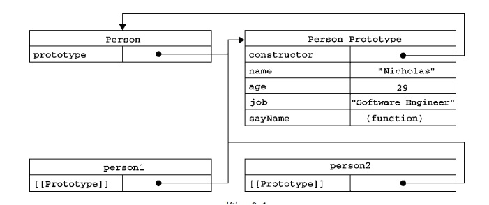
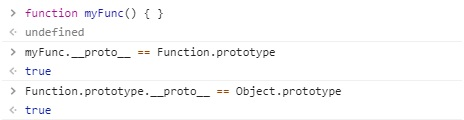
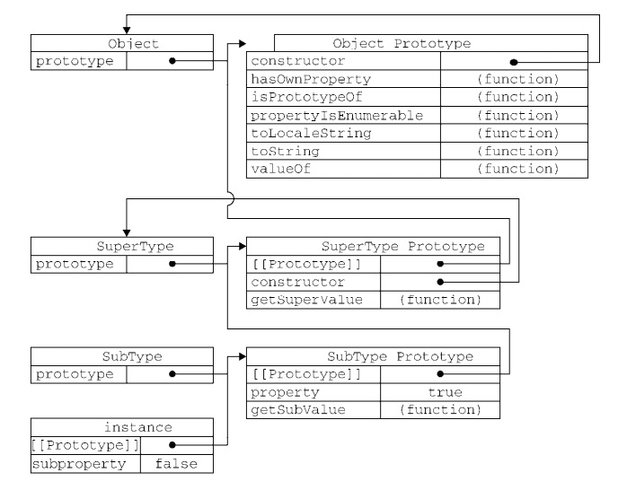

# javascript

## 防抖动和节流
```js
function debounce(func, delay) {
    let timeID = undefined;
    return function () {
        if (timeID) {
            clearTimeout(timeID);
        }

        timeID = setTimeout(func.bind(this, ...arguments), delay);
    }
} 

function throttle(func, delay) {
    let startTime = new Date().getTime();

    return function () {
        let presentTime = new Date().getTime();
        if (presentTime - startTime > delay) {
            func(...arguments);
            startTime = new Date().getTime();
        }
    }
}

const eventLog = (e) => { console.log('e', e); console.log(`hihi_____${Math.random() * 100}`) };

window.onload = () => {
    const body = document.querySelector('body');
    //body.addEventListener('mousemove', debounce(eventLog, 1000));
    body.addEventListener('mousemove', throttle(eventLog, 1000));
}
```

## 原生call、apply、bind
```js
let earth = {
    areaName: 'earth',
    welcome: function (name1, name2, nameArr) {
        console.log(`welcome to ${this.areaName},${name1} and ${name2}, ${nameArr.toString()}`);
    }
};

let school = {
    areaName: 'school'
};

earth.welcome.call(school, 'zhangsan', 'lisi', ['wanger', 'wangliu']);
Function.prototype.call2 = function (ctx) {
    const vFn = Symbol('vFn');
    ctx[vFn] = this;
    ctx[vFn](...[...arguments].slice(1));
    delete ctx[vFn];
};
earth.welcome.call2(school, 'zhangsan', 'lisi', ['wanger', 'wangliu']);

earth.welcome.apply(school, ['zhangsan', 'lisi', ['wanger', 'wangliu']]);
Function.prototype.apply2 = function (ctx) {
    const vFn = Symbol('vFn');
    ctx[vFn] = this;
    if (arguments.length == 1) {
        ctx[vFn]();
    } else {
        ctx[vFn](...[...arguments].slice(1)[0]);
    }
    delete ctx[vFn];
};
earth.welcome.apply2(school, ['zhangsan', 'lisi', ['wanger', 'wangliu']]);

earth.welcome.bind(school, 'zhangsan', 'lisi', ['wanger', 'wangliu'])();
Function.prototype.bind2 = function (ctx) {
    const vFn = Symbol('vFn');
    ctx[vFn] = this;
    let args = arguments;
    return function () {
        ctx[vFn](...[...args].slice(1));
        delete ctx[vFn];
    };
}
earth.welcome.bind2(school, 'zhangsan', 'lisi', ['wanger', 'wangliu'])();
```

## 原生ajax
```js
const xhr = new XMLHttpRequest();
xhr.open('post', 'getInfo', true);
xhr.send('userID=123&sex=male');
xhr.onreadystatechange = function () {
    if (this.readyState === 4 && this.status === 200) {
        console.log('success!this.responseText', this.responseText);
    }
}
```

## 数组扁平化
```js
const flatten = (arr) => {
    let res = [];
    arr.forEach(ele => {
        if (Array.isArray(ele)) {
            res = res.concat(flatten(ele));
        } else {
            res.push(ele);
        }
    });
    return res;
}

flatten([1, 2, [3, 4, [5, 6]]]);
```

## 前端错误监控
- fundebug 可回溯
- BadJS

## [对象属性描述符](https://developer.mozilla.org/zh-CN/docs/Web/JavaScript/Reference/Global_Objects/Object/defineProperty)
- configurable（能否delete）
- enumerable（能否枚举）
- writable（能否修改）
- value（属性值）
- set
- get

判断是否属于原型属性？
```js
const hasPrototypeProperty = (object, name) => {
    return !object.hasOwnProperty(name) && (name in object);
}
```

## 原型链和原型继承
- 原型链


- 原型继承

- 组合继承（call继承所有属性、原型指向父级对象继承所有方法）
```js
function SuperType(name) {
    this.name = name;
    this.colors = ['red', 'green', 'blue'];
}

SuperType.prototype.sayName = function () {
    console.log(this.name);
}

function SubType(name, age) {
    //  继承属性
    SuperType.call(this, name);
    this.age = age;
}

//  继承方法
SubType.prototype = new SuperType();
//  修复构造函数
SubType.prototype.constructor = SubType;

SubType.prototype.sayAge = function () {
    console.log(this.age);
}

const sub1 = new SubType('zhangsan', 23);
sub1.colors.push('black');
console.log(sub1.colors);

const sub2 = new SubType('lisi', 24);
console.log(sub2.colors);
```

## 内存泄露
- 变量依旧占据内存空间没有被释放，比如闭包
- js代码中对DOM节点的 引用，DOM节点被删除时，引用还在维持

## babel转换原理
AST

## currentTarget和target
e.currentTarget是注册事件的那个元素，e.target是实际发生事件的元素

## 堆栈
- 堆
动态分配的内存，大小不定也不会自动释放。复杂类型：空间大、大小不固定。
- 栈
自动分配的内存空间，由系统自动释放。基本类型：空间小、大小固定。存复杂类型指针。

## new发生了什么
new的过程实际分了三步
1. 创建一个以这个函数为原型的空对象
2. 将函数的`prototype`赋值给对象的`__proto__`属性
3. 将对象作为函数的`this`传进去，如果有`return`出来东西是对象的话就直接返回`return`的内容呢，没有的话就返回创建的这个对象

```js
function NewFunc(func) {
    let ret = {};
    if (func.prototype !== null) {
        ret.__proto__ = func.prototype;
    }

    let ret1 = func.apply(ret, Array.prototype.slice.call(arguments, 1));

    if (ret1 !== null(typeof ret1 === 'object') || typeof ret1 === 'function')) {
        return ret1;
    }

    return ret;
}
```

## 手写Promise

## fetch和ajax区别

## 跨域

## amd cmd commonjs umd

## 传统垃圾回收

## Chrome V8f分代回收

## Map和普通Object区别

## 事件系统

## 数组去重

## JS Bridge 